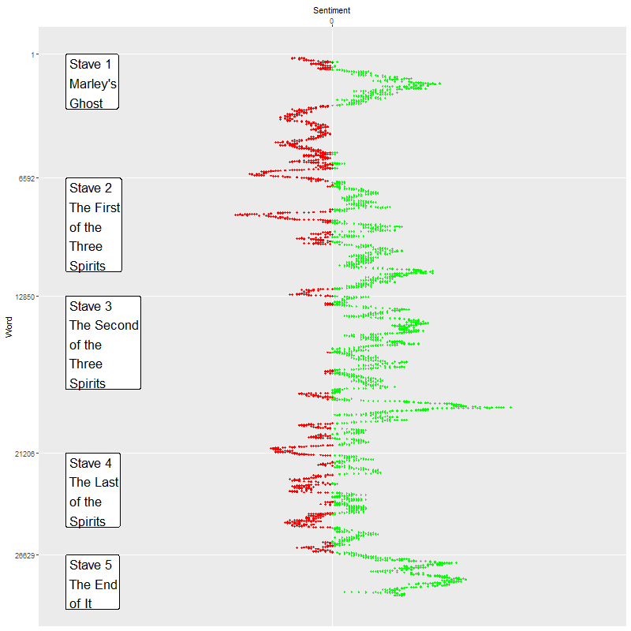
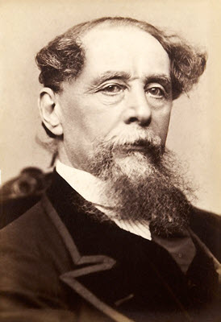

Introduction 
================================================================================

The recent formation of the UMKC Institute for Data Education, Analytics, and Science (IDEAS) is a recognition that data science touches many academic departments. It draws upon the strengths of Computer Science and Statistics and has been used successfully in Business, Education, Medicine, and Science. We need to promote data science early, at the undergraduate and high school level. Unfortunately, many of the applications of data science require specialized content knowlege and/or advanced mathematical and programming skills.

Senitment analysis, a form of text mining, is an branch of data science that is accessible at any level of education, requires no mathematics beyond basic counting, and can be easily programmed in any language. It uses simple graphical summaries. It allows for simple improvements and customization. Most importantly, it can be applied to areas where students already have a high level of familiarity.

This poster shows a simple application of sentiment analysis to a popular and well-known book, *A Christmas Carol*, written by Charles Dickens. The book is divided into five easily recognized sections:

* Stave 1. Marley's Ghost, 
* Stave 2. The First of the Three Spirits,
* Stave 3. The Second of the Three Spirits,
* Stave 4. The Last of the Spirits, and
* Stave 5. The End of It.

This poster will show how this sentiment analysis of *A Christmas Carol* was conducted (hint: it was very easy) and suggest some enhancements and extensions that you should encourage your students to consider.

Methods
================================================================================

The raw text for *A Christmas Carol* was downloaded from the Guttenberg Project website (www.guttenberg.org) and analyzed using the R programming language (version 3.4.3) and the AFINN sentiment lexicon (github.com/fnielsen/afinn/tree/master/afinn/data).

The actual analysis, however, does not require R and can easily be replicated in any system. Here are the steps:

* Pre-process the data
  + Remove punctuation
  + Convert everything to lower case
  + Split into individual words
* Merge with sentiment lexicon
  + Assign zero to unmatched words
  + Smooth the data with a moving average
* Plot the results
  + Add labels

You can find the code that produced this analysis and this poster on my github site (github.com/pmean/text-mining-examples).


Table 1. Pre-processed data
================================================================================

```{r raw-data, echo=FALSE, comment=""}
suppressWarnings(suppressMessages(library(dplyr)))
suppressWarnings(suppressMessages(library(magrittr)))
suppressWarnings(suppressMessages(library(sentimentr)))
suppressWarnings(suppressMessages(library(SnowballC)))
suppressWarnings(suppressMessages(library(tidytext)))
suppressWarnings(suppressMessages(library(tidyverse)))
suppressWarnings(suppressMessages(library(wordcloud)))
load("../data/christmas-carol.RData")
# cat(cc_trimmed_text[353:359], sep="\n")
data.frame(cc_smooth[1013:1024, c(1, 5)])
```

Table 2. Lexicon
================================================================================

```{r lexicon, echo=FALSE, comment=""}
# sample_sentiments
data.frame(sentiments[sentiments$lexicon=="AFINN", ][1:12, c(1, 3, 4)])
```

Major points 
================================================================================

## Data science needs *great teaching examples*, especially if you want to reach undergraduate and high school students. These examples need to be *easy to run* and *easy to relate to*.

## The ideal methodology is *text mining*  and *sentiment analysis* because it requires *no complex mathematics* and *no specialized programming*

## The *best data source* for text mining is *A Christmas Carol* by Charles Dickens. This book is *universally recognized* and has a *well demarcated plot line*.

Figure 1. Sentiment graph
================================================================================

::: {.figure-example}

:::


Limitations
================================================================================

While interesting, there are serious limitations to sentiment analysis. While these limitations and efforts to overcome them as well known in the text mining community, you should encourage your students identify them independently. Some possible areas of discussion might include:

* How to handle negations 
  + 'It's **not convenient**,' said Scrooge, 'and it's **not fair**.
* How to handle double meanings
  + ... though the Spirit's eyes were clear and **kind**, he did not like to meet them.
  + 'Would it apply to any **kind** of dinner on this day?' asked Scrooge.
* How to handle sarcasm
  + 'If these shadows remain unaltered by the Future none other of my race,' returned the Ghost, 'will find him here. What then? If he be like to die, **he had better do it, and decrease the surplus population**.'
* How to handle abstract images and symbols
  + There is no doubt that **Marley was dead**. This must be distinctly understood, or nothing wonderful can come of the story I am going to relate.

Table 3. Merged data
================================================================================

```{r processed-data, echo=FALSE, comment=""}
data.frame(cc_smooth[1013:1024, c(1, 5, 2)])
```

Authors' contributions
================================================================================

Charles Dickens provided the raw data. Steve Simon analyzed the data and produced the graphs.

::: {.logo-example}



:::


Extensions
================================================================================

The graph shown to the left has a few landmarks shown, but there are other (and better) ways to orient the peaks and valleys in sentiment to events in the book:

* illustrations,
* famous quotes, or
* first mention of key characters.

Other modifications include using different

* sentiment lexicons, or
* smoothing techniques.

There are many freely available text sources that are just as easy to conduct sentiment analysis on. Here are some examples.

* Harry Potter series (github.com/bradleyboehmke/harrypotter)
* Psalms (www.gutenberg.org/cache/epub/10/pg10.txt)
* Donald Trump's twitter feed (www.trumptwitterarchive.com/)
* Amazon reviews (snap.stanford.edu/data/web-Amazon.html)


